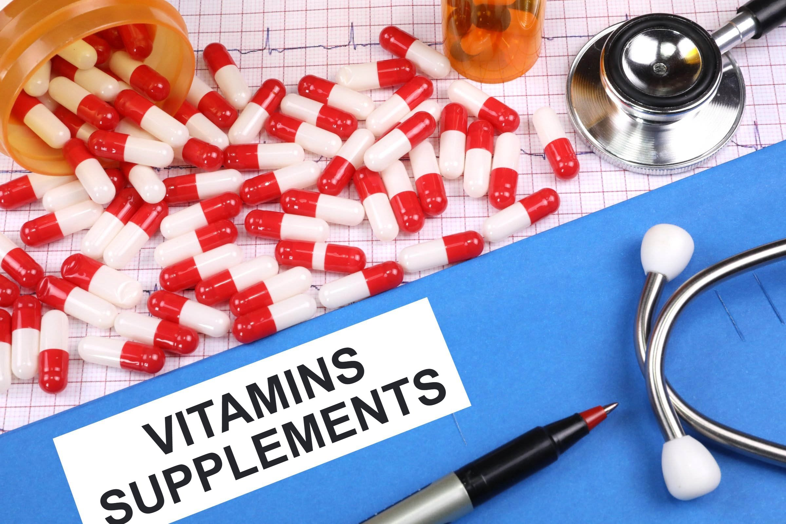

# supplements
보충제 리스트

## 주의사항

임상이 끝나지않고 부작용 리포트가 부족한 보충제들이 대부분이므로, 부작용 위험이 있음을 꼭 인지하고, 적은 용량에서 시작하여 늘려나가야함. 아래의 보충제들은 저에게는 테스트를 통해 맞는 보충제들었고, 다른 사람들이 복용했을 경우 문제가 될 수 있으므로 꼭 의사와 상담을 해야합니다.

잘못된 정보나 문제가 있는 경우가 있으면 리포트 환영합니다.

## 항산화제

### 글루타치온

[출처](https://www.youtube.com/watch?v=Srmaavfr71M) #youtube

#### 상
- Acetyl-GLUTATHIONE(AC 글루타치온) 125MG by APEX 
- Liposomal Glutathione(리포소몰 글루타치온) 250MG 
> 퓨어제품은 국내 총판의 마진과 판매가격때문에 직구판매를 막을려고 한다고 합니다. 그래서 UO, 디자인포헬스, 옵티멀 제품들을 추천합니다.
- Liposomal Liquid Glutathione(리포소몰 액상 글루타치온)100MG 

#### 중
- Reduced Glutathione(리듀스드 글루타치온) 150MG by Ultimate Opt
- GLUTATHIONE-SR(글루타치온) 175MG by Thorne 
- Reduced Glutathione(글루타치온) 100MG 
> 퓨어제품은 국내 총판의 마진과 판매가격때문에 직구판매를 막을려고 한다고 합니다. 그래서 댓글에는 달아놓았지만 대용량으로 하루 1000mg을 쉽게 사용하실 수 있는 디자인 포 헬스사 리듀스드 파우더를 추천합니다.
- Brocco-Glutathione, 500 MG by Nature's Answer

#### 하
- Now XXXX사, Healthy XXXXXX사 

> 제가 생각하는 글루타치온 복용의 최적의 조합: 글루타치온 자체 + 글루타치온 리싸이클링
: 글루타치온 자체만으로도 만성질환, 만성피로에 효과가 있지만 항산화제(NAC, 알파라이포익산 등), 밀크티슬 등을 다른 건강상의 이유로 드시는 분들은 리포트로픽 디톡스 제품이 글루타치온 리싸이클링 효과로 체내뿐만 아니라 세포 내 글루타치온 레벨을 상승시켜 추천해 드린 것입니다. 글루타치온 제품만 드셔도 충분히 효과는 좋아요 from Dr.Danny

### 알파리포산

- 500mg 아침

### 글라이신

- 콜라겐의 원료이자 글루타치온의 전구체: 수면유도에도 좋다고 함

- 1000mg 저녁

### TMG(트라이메틸글라이신)

- 1000mg 아침 저녁

### 피세틴

- 항산화, 좀비세포 제거함
- 간헐적 단식을 병행하며 고용량 용법으로 효과를 보는 경우가 많음

## 비타민

- 비타민 D3 권장 복용량은 2000IU인데, 나는 매일 5000IU 예전엔 10000IU 고용량 복용함 => 자가면역질환이 있는 사람은 이정도 => 아침에 복용. 용량참고: [**youtube** 백병원 박현아 교수: 비타민D 섭취 시 주의할 점 5가지](https://www.youtube.com/watch?v=HaL4uPGOcOM)
- 비타민 B군: Jarrow Fomular B-Right 아침
- 비타민 B12: 1000mg 이상 아침
- 비타민 K2: MenaQ7, 아침 저녁
- 비타민 C: 고용량이 의미가 없다고 함. 수용성이기 때문에 200mg는 몸에서 사용되고 나머지는 바로 소변으로 배출, 따라서 Timed release 추천 => 500mg 최초 release 후 남은 500mg을 20시간동안 천천히 release => Solaray 서방형 비타민C 1000mg
## 미네랄

- 라이프 익스텐션 온리 트레이스 미네랄스: 일반적인 사람은 복합 미네랄 제제가 적당해 보임
- 아연: 도파민 합성에 필요 (L-타이로신 섭취에 약간의 아연이 필요)
- 구리: 아연과 구리는 흡수 racing 이 걸리므로 아연을 섭취할 경우 구리도 적당량 섭취를 해주어야 한다고 함. 한 종류만 섭취하면 다른 하나의 결핍이 있을 수 있음
- 칼슘 / 마그네슘: 칼슘과 마그네슘도 하나만 섭취하면 다른 하나의 결핍이 있을 수 있음

## 기타

- 활성엽산(5-MTHF): 1000mg 이상 아침 저녁 2번
- 코엔자임큐텐 + PQQ: Jarrow Formulas, Ubiquinol, QH-Absorb + PQQ
- L글루타민: 대장 기능, 에너지, 점막 재생 등 장누수증후군에 효과 있음. [**youtube** 닥터조(장누수증후군에 처방하는 글루타민)](https://www.youtube.com/watch?v=yAPeiRywC2I)
- 아스피린: 혈전 예방, 심혈관 위험 예방. 81mg 베이비 아스피린 하루 1알 => [**book** 노화의 종말](https://www.aladin.co.kr/shop/wproduct.aspx?ItemId=247395152)
- 디오스민: 순환 장애 개선, 450mg 아침 저녁
- 가바: 750mg 저녁
- HCl 베타인: 단백질 소화기능을 돕고 대장으로 소화가 덜된 단백질이 공급되는 것을 막아주지만, 여기서 목적은 많은 보충제의 흡수율을 높히기 위함
- NMN: 프로헬스 제품 하루 최대 1000mg => 노화 치료, DNA 생성에 관여 [**book** 노화의 종말](https://www.aladin.co.kr/shop/wproduct.aspx?ItemId=247395152)
- 트렌스 레스베라트롤: 프로헬스 1000mg => NMN 부스팅 [**book** 노화의 종말](https://www.aladin.co.kr/shop/wproduct.aspx?ItemId=247395152)
- AMPK: 미토콘드리아 기능, 운동하기 전에 섭취
- 오토파지 리뉴(지로프로텍트): 자가포식 기능 촉진, 신경염증 제거에 효과
- 커큐민: 항산화, 항염증
- L타이로신: 도파민 전구 아미노산, B6와 아연이 필요. L도파보다 필요한 경우 생성하게 되므로 비교적 안전하다고 판단. [**youtube** 닥터조(우울증, 무기력감, 집중력장애 그리고 도파민)](https://www.youtube.com/watch?v=q05ZKJH_D24)

## 필수 보충제

필수지만 만성 부족 상태

- 활성 엽산(5-MTHF)
- 비타민 D3
- 비타민 B6, B12

## License

MIT License